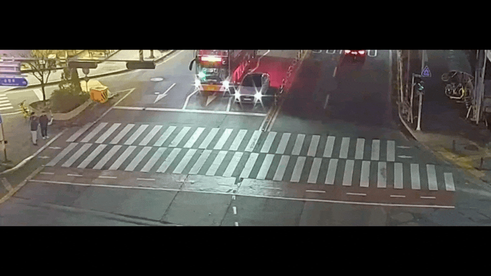

# 보행자 안전 및 무단횡단 방지 시스템
YOLOv11n를 이용하여 비디오 속 보행자의 안전 상태 및 무단횡단을 감지하는 시스템입니다.

시연 영상

### 기능

- **적색 신호일 때 보행 대기자가 횡단보도를 건너거나 횡단보도에서 튀어나와 있는 경우 경고를 보냅니다.**
- 영상 속에서 **횡단보도 영역**과 **횡단보도 대기 영역**을 설정할 수 있으며, 이를 기준으로 경고 여부를 판단합니다.
- **학교 앞 버스 정류장**과 같이 양쪽으로 차가 다니지만 안전 장치 설치가 어려운 위험한 공간에서 보행자에게 위험을 상기시키고 사고를 예방할 수 있습니다.
- 별도의 센서나 하드웨어를 설치하지 않아도, 이미 존재하는 CCTV를 활용해 **솔루션을 빠르게 도입**할 수 있습니다.

### 제작 프로그램 설명
- 영상은 **네이버 지도의 CCTV 영상**을 소스로 사용했습니다.
- 무단횡단 하는 사람에게 경고를 주는 프로그램으로, 무단횡단 영상을 찾으려고 하였으나 결국 찾지 못했습니다.
- 따라서 임의로 저희가 신호를 변경하는 함수를 제작하였습니다. (get_traffic_light_status 함수) 실제로 도입하게 된다면 교통 시스템에 연결해서 사용할 수 있습니다.
- 한국에서 사용하는 프로그램이기에, draw_text_korean 함수로 영상 속 경고를 한국어로 출력되게 제작하였습니다. (폰트는 네이버 나눔고딕을 사용했습니다.)
- 신호에 맞춰 횡단보도 위를 건너는 사람들을 판단하여 '건너세요!' 또는 '위험합니다!'라는 경고 문구가 출력됩니다.
- 횡단보도 바로 앞에 있는 사람에게도 빨간 불일 때 '위험합니다!'라는 문구가 출력됩니다. (사고 예방 차원)
- 횡단보도를 건너는 부분은 배속하여, 시스템이 빠른 속도에서도 정확하게 사람을 탐지하는 것을 확인할 수 있습니다.

###### 팀원- contribute
코딩은 모두 같이 도와줬는데, 깃허브 팀 레포지토리 clone pull push PullRequest를 안해서 마지막 수정자인 시온이형이 전부 올렸습니다.
